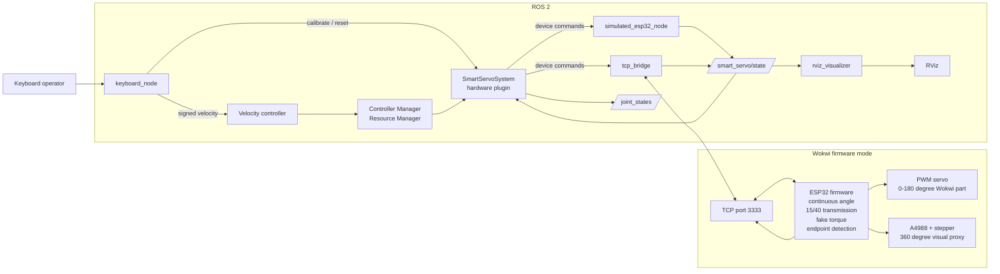

# Smart servo system diagram

Only one transport is selected at launch:

| Launch mode | Active transport |
|---|---|
| `mode:=simulated` | `simulated_esp32_node` |
| `mode:=wokwi` | `tcp_bridge` and ESP32 firmware |

## Component responsibilities

| Component | Responsibility |
|---|---|
| `keyboard_node` | Converts keyboard input to velocity, calibration, and reset commands |
| Velocity controller | Owns the motor velocity command interface |
| Resource Manager | Loads hardware and provides command/state interfaces |
| `SmartServoSystem` | Translates controller velocities to device commands and state to joint values |
| `simulated_esp32_node` | Software-only copy of the firmware state machine |
| `tcp_bridge` | Carries commands/state between ROS and Wokwi over TCP |
| ESP32 firmware | Calculates motion, gearing, torque, calibration, and limits |
| PWM servo | Demonstrates the actual ESP32 servo interface |
| Stepper proxy | Displays the unlimited motor angle in Wokwi |
| `rviz_visualizer` | Displays motor angle, door angle, torque, and endpoints |

The motor angle is continuous. The door angle is calculated as
`motor angle × 15/40`. After calibration, the firmware clamps the door angle to
the detected closed/open interval.
